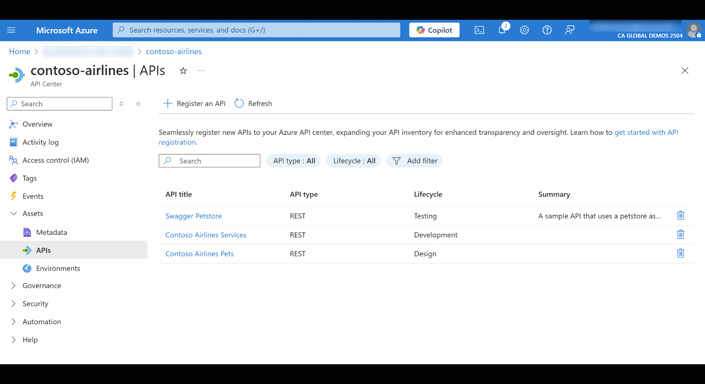
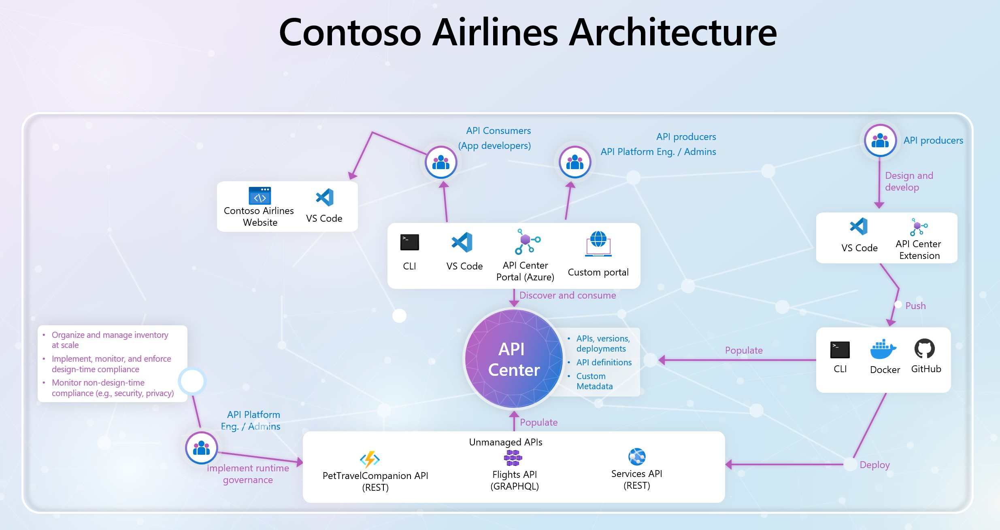
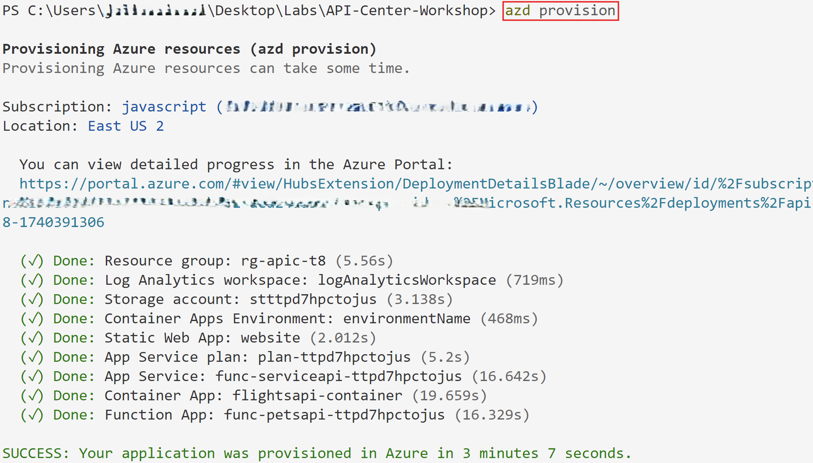
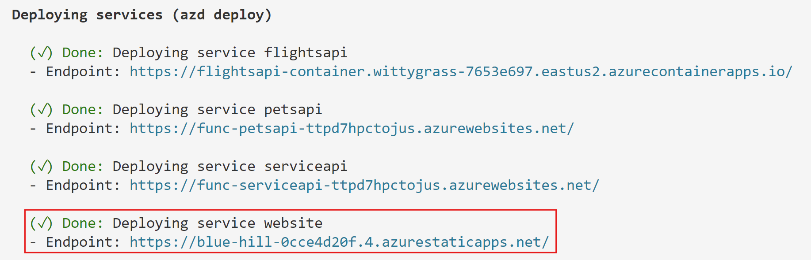

<!-- prettier-ignore -->
<div align="center">


# Azure API Center Workshop

<!-- [](https://codespaces.new/Azure-Samples/deepseek-js?hide_repo_select=true&ref=main&quickstart=true) -->
[](https://www.youtube.com/watch?v=Dvar8Dg25s0&list=PLI7iePan8aH75Qz8h4yQBEC-uS339CUyi)
[](https://github.com/Azure-Samples/deepseek-js/actions)

[](https://www.typescriptlang.org)
[](LICENSE)

:star: If you like this sample, star it on GitHub — it helps a lot!



</div>

This workshop gives you a comprehensive understanding of how to enhance the API management and governance strategies in your organization with **Azure API Center**, which is **a structured inventory for tracking all your organizational APIs, enhancing discoverability, development, and reuse regardless of their type, lifecycle stage or deployment location.**

> [!NOTE]
> Head over to 🔗 https://aka.ms/APICenter/Workshop to begin the workshop.

## Overview
API Management is a broad term encompassing various aspects of managing APIs, and this workshop highlights a new service on Azure, Azure API Center, that concentrates on API registration (inventory) and design-time governance, helping you maintain a structured API inventory and ensuring your APIs meet organizational standards from the design phase.

<div align="center">
  
</div>

**Contoso Airlines** is a fictional airline company that offers a variety of services to its customers. The company has:

- A simple website using static HTML hosted on [Azure Static Web Apps](https://learn.microsoft.com/azure/static-web-apps/overview).
- A services REST APIs deployed on [Azure App Service](https://learn.microsoft.com/en-us/azure/app-service/overview) 
- A travel pet companions REST API hosted on [Azure Functions](https://learn.microsoft.com/en-us/azure/azure-functions/functions-overview?pivots=programming-language-javascript)
- A flights GraphQL API hosted on [Azure Container Apps](https://learn.microsoft.com/en-us/azure/container-apps/overview)
- An API Inventory managed by [Azure API Center](https://learn.microsoft.com/en-us/azure/api-center/overview)

## Deploy to Azure

To run this sample, you first need to provision the Azure resources needed and deploy the sample.

Open a terminal and run the following command to download the project code:

```shell
azd init -t Azure-Samples/API-Center-Workshop
```

> [!NOTE]
> This command will initialize a git repository, so you do not need to clone this repository.

Login to your Azure account:

```shell
azd auth login
```

Create a new azd environment:

```shell
azd env new
```

Enter a name that will be used for the resource group.
This will create a new folder in the `.azure` folder, and set it as the active environment for any calls to `azd` going forward.

Provision the infrastructure needed to run the application.

```shell
azd provision
```

> [!IMPORTANT]
> This application specifically requires some environment variables to be available during the packaging phase. This is why we need to provision the infra first before packaging and deploying the app. In most cases, simply running 'azd up' will package, provision and deploy your apps.

<div align="center">
  
</div>

Package and deploy the app to Azure:

```shell
azd package
azd deploy
```

After the application has been successfully deployed you will see a few URLs printed to the console. Click on the `service website Endpoint` to interact with the website in your browser.

<div align="center">
  
</div>

> [!NOTE]
> Head over to 🔗 https://aka.ms/APICenter/Workshop to continue with the workshop.
